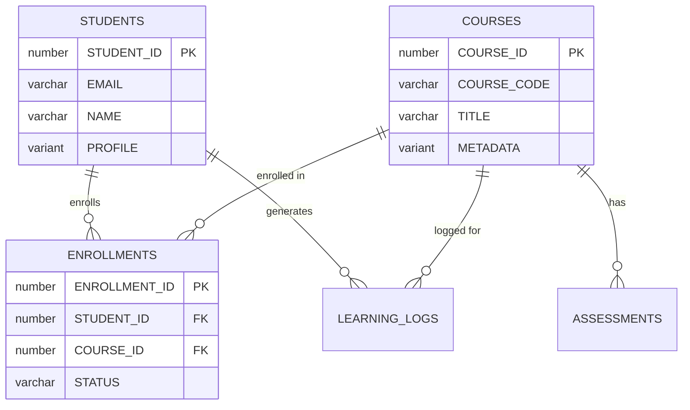

# Snowflake Database Schema Design


## When to use this skill

- **New Project**: Snowflake 데이터베이스 스키마 설계
- **Schema Refactoring**: 성능 또는 확장성을 위한 기존 스키마 재설계
- **Relationship Definition**: 테이블 간 관계 구현
- **Data Loading**: COPY INTO, Stage, Pipe를 통한 데이터 적재 파이프라인 설계
- **Performance Issues**: Clustering, Micro-partition pruning 최적화

## Input Format

### Required Information
- **Domain Description**: 어떤 데이터를 저장할 것인가 (예: 교육 플랫폼, 분석 파이프라인)
- **Key Entities**: 핵심 데이터 객체 (예: Student, Course, Enrollment)

### Optional Information
- **Expected Data Volume**: Small (<1M rows), Medium (1M-100M), Large (>100M) (default: Medium)
- **Read/Write Pattern**: Batch load + analytics, Streaming, Mixed (default: Batch + analytics)
- **Semi-structured Data**: JSON/Parquet/Avro 데이터 포함 여부 (default: false)
- **Time Travel Requirements**: 보존 기간 (default: 1 day, max 90 days for Enterprise)
- **Multi-cluster Warehouse**: 동시성 요구사항 (default: false)

### Input Example

```
Design a Snowflake database for an education analytics platform:
- Entities: Student, Course, Enrollment, Assessment, LearningLog
- Relationships:
  - A Student can enroll in multiple Courses (N:M)
  - An Assessment belongs to a Course
  - LearningLog stores JSON activity data per Student
- Expected data: 500K students, 10M learning logs/month
- Batch load from S3 daily + real-time streaming via Snowpipe
```

## Instructions

### Step 1: Define Database and Schema Structure

Snowflake는 `DATABASE > SCHEMA > TABLE` 3-tier 네임스페이스를 사용한다.

**Tasks**:
- 도메인별 Database 분리 (RAW, STAGING, ANALYTICS 등)
- Schema로 논리적 그룹핑
- 네이밍 컨벤션 확립 (UPPER_SNAKE_CASE 권장)

**Example** (Education Platform):
```sql
-- Database 생성
CREATE DATABASE IF NOT EXISTS EDU_ANALYTICS;

-- Schema 분리
CREATE SCHEMA IF NOT EXISTS EDU_ANALYTICS.RAW;        -- 원본 데이터
CREATE SCHEMA IF NOT EXISTS EDU_ANALYTICS.STAGING;    -- 변환 중간 단계
CREATE SCHEMA IF NOT EXISTS EDU_ANALYTICS.ANALYTICS;  -- 분석용 최종 테이블
CREATE SCHEMA IF NOT EXISTS EDU_ANALYTICS.COMMON;     -- 공통 참조 테이블
```

### Step 2: Define Entities and Data Types

Snowflake 전용 데이터 타입을 활용하여 엔티티를 정의한다.

**Snowflake 주요 데이터 타입**:
| 타입 | 용도 |
|------|------|
| `NUMBER(p,s)` | 정수/소수 (최대 38자리) |
| `VARCHAR(n)` | 가변 문자열 (최대 16MB) |
| `TIMESTAMP_LTZ` | 로컬 타임존 포함 타임스탬프 |
| `TIMESTAMP_NTZ` | 타임존 없는 타임스탬프 |
| `TIMESTAMP_TZ` | 타임존 오프셋 포함 타임스탬프 |
| `VARIANT` | 반정형 데이터 (JSON, Avro, Parquet) |
| `OBJECT` | 키-값 쌍 (VARIANT 하위) |
| `ARRAY` | 배열 (VARIANT 하위) |
| `GEOGRAPHY` | 지리 공간 데이터 |
| `BOOLEAN` | 참/거짓 |
| `DATE` | 날짜 |

**Example**:
```sql
CREATE TABLE EDU_ANALYTICS.ANALYTICS.STUDENTS (
    STUDENT_ID NUMBER AUTOINCREMENT PRIMARY KEY,
    EMAIL VARCHAR(255) NOT NULL,
    NAME VARCHAR(100) NOT NULL,
    PROFILE VARIANT,                    -- JSON 프로필 데이터
    ENROLLMENT_DATE DATE DEFAULT CURRENT_DATE(),
    CREATED_AT TIMESTAMP_LTZ DEFAULT CURRENT_TIMESTAMP(),
    UPDATED_AT TIMESTAMP_LTZ DEFAULT CURRENT_TIMESTAMP()
);

CREATE TABLE EDU_ANALYTICS.ANALYTICS.COURSES (
    COURSE_ID NUMBER AUTOINCREMENT PRIMARY KEY,
    COURSE_CODE VARCHAR(20) NOT NULL,
    TITLE VARCHAR(255) NOT NULL,
    DESCRIPTION VARCHAR(5000),
    METADATA VARIANT,                   -- 과목 메타데이터 (태그, 카테고리 등)
    CREDITS NUMBER(2,0) DEFAULT 3,
    IS_ACTIVE BOOLEAN DEFAULT TRUE,
    CREATED_AT TIMESTAMP_LTZ DEFAULT CURRENT_TIMESTAMP()
);

CREATE TABLE EDU_ANALYTICS.ANALYTICS.ENROLLMENTS (
    ENROLLMENT_ID NUMBER AUTOINCREMENT PRIMARY KEY,
    STUDENT_ID NUMBER NOT NULL REFERENCES STUDENTS(STUDENT_ID),
    COURSE_ID NUMBER NOT NULL REFERENCES COURSES(COURSE_ID),
    ENROLLED_AT TIMESTAMP_LTZ DEFAULT CURRENT_TIMESTAMP(),
    STATUS VARCHAR(20) DEFAULT 'ACTIVE',  -- ACTIVE, COMPLETED, DROPPED
    GRADE VARCHAR(2),
    UNIQUE (STUDENT_ID, COURSE_ID)
);

CREATE TABLE EDU_ANALYTICS.ANALYTICS.LEARNING_LOGS (
    LOG_ID NUMBER AUTOINCREMENT,
    STUDENT_ID NUMBER NOT NULL,
    COURSE_ID NUMBER NOT NULL,
    ACTIVITY_DATA VARIANT,              -- JSON 활동 로그
    EVENT_TYPE VARCHAR(50),
    EVENT_TIMESTAMP TIMESTAMP_LTZ DEFAULT CURRENT_TIMESTAMP(),
    INGESTED_AT TIMESTAMP_LTZ DEFAULT CURRENT_TIMESTAMP()
);
```

### Step 3: Design Clustering and Partitioning

Snowflake는 자동 Micro-partitioning을 사용하지만, `CLUSTER BY`로 쿼리 성능을 최적화할 수 있다.

**Tasks**:
- 대용량 테이블에 `CLUSTER BY` 설정
- 자주 필터링하는 컬럼을 클러스터링 키로 선택
- Micro-partition pruning 효율성 확인

**Clustering 가이드라인**:
- 100M+ 행 테이블에서 효과적
- WHERE 절에 자주 사용되는 컬럼 선택
- 카디널리티가 적절한 컬럼 (너무 높거나 낮으면 비효율)
- 최대 3-4개 컬럼 권장

**Example**:
```sql
-- 학습 로그: 날짜와 학생 기준으로 자주 조회
ALTER TABLE EDU_ANALYTICS.ANALYTICS.LEARNING_LOGS
    CLUSTER BY (EVENT_TIMESTAMP::DATE, STUDENT_ID);

-- 클러스터링 상태 확인
SELECT SYSTEM$CLUSTERING_INFORMATION('EDU_ANALYTICS.ANALYTICS.LEARNING_LOGS');

-- 클러스터링 깊이 확인
SELECT SYSTEM$CLUSTERING_DEPTH('EDU_ANALYTICS.ANALYTICS.LEARNING_LOGS');
```

**Table Types**:
```sql
-- Transient Table: Time Travel 1일, Fail-safe 없음 (임시 데이터)
CREATE TRANSIENT TABLE EDU_ANALYTICS.STAGING.TEMP_IMPORT (
    RAW_DATA VARIANT,
    LOADED_AT TIMESTAMP_LTZ DEFAULT CURRENT_TIMESTAMP()
);

-- Temporary Table: 세션 종료 시 자동 삭제
CREATE TEMPORARY TABLE SESSION_CACHE (
    KEY VARCHAR(100),
    VALUE VARIANT
);
```

### Step 4: Set Up Data Loading Pipeline

Snowflake의 데이터 로딩 메커니즘을 설계한다.

**Tasks**:
- External/Internal Stage 설정
- File Format 정의
- COPY INTO 또는 Snowpipe 구성

**Example**:
```sql
-- File Format 정의
CREATE FILE FORMAT EDU_ANALYTICS.RAW.JSON_FORMAT
    TYPE = 'JSON'
    STRIP_OUTER_ARRAY = TRUE
    COMPRESSION = 'AUTO';

CREATE FILE FORMAT EDU_ANALYTICS.RAW.CSV_FORMAT
    TYPE = 'CSV'
    FIELD_DELIMITER = ','
    SKIP_HEADER = 1
    NULL_IF = ('NULL', 'null', '')
    COMPRESSION = 'AUTO';

-- External Stage (S3)
CREATE STAGE EDU_ANALYTICS.RAW.S3_STAGE
    URL = 's3://edu-data-bucket/raw/'
    STORAGE_INTEGRATION = S3_INTEGRATION
    FILE_FORMAT = EDU_ANALYTICS.RAW.JSON_FORMAT;

-- COPY INTO로 배치 로딩
COPY INTO EDU_ANALYTICS.RAW.LEARNING_LOGS_RAW
    FROM @EDU_ANALYTICS.RAW.S3_STAGE/learning_logs/
    FILE_FORMAT = EDU_ANALYTICS.RAW.JSON_FORMAT
    PATTERN = '.*\\.json\\.gz'
    ON_ERROR = 'CONTINUE';

-- Snowpipe (자동 연속 로딩)
CREATE PIPE EDU_ANALYTICS.RAW.LEARNING_LOGS_PIPE
    AUTO_INGEST = TRUE
    AS
    COPY INTO EDU_ANALYTICS.RAW.LEARNING_LOGS_RAW
        FROM @EDU_ANALYTICS.RAW.S3_STAGE/learning_logs/
        FILE_FORMAT = EDU_ANALYTICS.RAW.JSON_FORMAT;
```

### Step 5: Configure Time Travel and Data Protection

**Tasks**:
- Time Travel 보존 기간 설정
- 중요 테이블 보호 전략

**Example**:
```sql
-- 분석 테이블: 7일 Time Travel
ALTER TABLE EDU_ANALYTICS.ANALYTICS.STUDENTS
    SET DATA_RETENTION_TIME_IN_DAYS = 7;

ALTER TABLE EDU_ANALYTICS.ANALYTICS.ENROLLMENTS
    SET DATA_RETENTION_TIME_IN_DAYS = 7;

-- Time Travel로 과거 데이터 조회
SELECT * FROM EDU_ANALYTICS.ANALYTICS.STUDENTS
    AT (OFFSET => -3600);  -- 1시간 전

SELECT * FROM EDU_ANALYTICS.ANALYTICS.STUDENTS
    BEFORE (TIMESTAMP => '2024-01-15 10:00:00'::TIMESTAMP_LTZ);

-- 실수로 삭제한 테이블 복구
UNDROP TABLE EDU_ANALYTICS.ANALYTICS.STUDENTS;
```

### Step 6: Design Streams and Tasks (CDC Pipeline)

변경 데이터 캡처(CDC)와 자동화된 데이터 변환을 설계한다.

**Example**:
```sql
-- Stream: RAW 테이블의 변경사항 추적
CREATE STREAM EDU_ANALYTICS.STAGING.LEARNING_LOGS_STREAM
    ON TABLE EDU_ANALYTICS.RAW.LEARNING_LOGS_RAW;

-- Task: Stream 데이터를 주기적으로 Analytics로 변환
CREATE TASK EDU_ANALYTICS.STAGING.TRANSFORM_LEARNING_LOGS
    WAREHOUSE = TRANSFORM_WH
    SCHEDULE = 'USING CRON 0 * * * * UTC'  -- 매시간
    WHEN SYSTEM$STREAM_HAS_DATA('EDU_ANALYTICS.STAGING.LEARNING_LOGS_STREAM')
AS
    INSERT INTO EDU_ANALYTICS.ANALYTICS.LEARNING_LOGS (
        STUDENT_ID, COURSE_ID, ACTIVITY_DATA, EVENT_TYPE, EVENT_TIMESTAMP
    )
    SELECT
        RAW_DATA:student_id::NUMBER,
        RAW_DATA:course_id::NUMBER,
        RAW_DATA,
        RAW_DATA:event_type::VARCHAR,
        RAW_DATA:event_timestamp::TIMESTAMP_LTZ
    FROM EDU_ANALYTICS.STAGING.LEARNING_LOGS_STREAM
    WHERE METADATA$ACTION = 'INSERT';

-- Task 활성화
ALTER TASK EDU_ANALYTICS.STAGING.TRANSFORM_LEARNING_LOGS RESUME;

-- Dynamic Table (선언적 파이프라인)
CREATE DYNAMIC TABLE EDU_ANALYTICS.ANALYTICS.STUDENT_COURSE_SUMMARY
    TARGET_LAG = '1 hour'
    WAREHOUSE = TRANSFORM_WH
AS
    SELECT
        s.STUDENT_ID,
        s.NAME,
        COUNT(DISTINCT e.COURSE_ID) AS ENROLLED_COURSES,
        COUNT(l.LOG_ID) AS TOTAL_ACTIVITIES,
        MAX(l.EVENT_TIMESTAMP) AS LAST_ACTIVITY
    FROM EDU_ANALYTICS.ANALYTICS.STUDENTS s
    LEFT JOIN EDU_ANALYTICS.ANALYTICS.ENROLLMENTS e
        ON s.STUDENT_ID = e.STUDENT_ID
    LEFT JOIN EDU_ANALYTICS.ANALYTICS.LEARNING_LOGS l
        ON s.STUDENT_ID = l.STUDENT_ID
    GROUP BY s.STUDENT_ID, s.NAME;
```

## Output Format

### Basic Structure

```
database/
├── 01_databases_and_schemas.sql    -- DB/Schema 생성
├── 02_tables.sql                   -- 테이블 DDL
├── 03_clustering.sql               -- 클러스터링 설정
├── 04_stages_and_formats.sql       -- Stage, File Format
├── 05_pipes.sql                    -- Snowpipe 설정
├── 06_streams_and_tasks.sql        -- CDC 파이프라인
├── 07_dynamic_tables.sql           -- Dynamic Tables
└── docs/
    └── ERD.md                      -- Mermaid ERD 다이어그램
```

### ERD Diagram (Mermaid Format)



## Constraints

### Mandatory Rules (MUST)

1. **Primary Key Required**: 모든 테이블에 Primary Key 정의
   - Snowflake PK는 참조 무결성을 강제하지 않지만, 쿼리 최적화에 활용됨
   - 옵티마이저 힌트로 작동

2. **네임스페이스 명시**: 항상 `DATABASE.SCHEMA.TABLE` 전체 경로 사용
   - 모호성 방지
   - 환경 간 이식성

3. **VARIANT 데이터 구조 문서화**: 반정형 컬럼의 예상 스키마를 주석으로 기술
   - VARIANT는 스키마리스이므로, 예상 구조를 코드로 문서화

### Prohibited Actions (MUST NOT)

1. **과도한 클러스터링**: 소규모 테이블(<100M 행)에 불필요한 CLUSTER BY 적용 금지
   - 자동 클러스터링 크레딧 낭비
   - Micro-partition이 자동 관리하는 범위 내

2. **VARIANT 남용**: 정형 데이터를 VARIANT에 저장하지 않음
   - 쿼리 성능 저하
   - 타입 안전성 상실

3. **민감 데이터 평문 저장**: 개인정보, 비밀번호 등을 암호화 없이 저장 금지
   - Masking Policy 또는 External Tokenization 활용

### Performance Rules

- **결과 캐시 활용**: 동일 쿼리 반복 시 `RESULT_USE_CACHING = TRUE` 확인
- **Warehouse 적정 크기**: 쿼리 패턴에 맞는 Warehouse 크기 선택
- **Zero-copy Cloning**: 개발/테스트 환경에 `CREATE TABLE ... CLONE` 활용

## Best Practices

### Quality Improvement

1. **UPPER_SNAKE_CASE Naming**: Snowflake는 기본적으로 대문자 식별자 사용
   - `STUDENTS`, `COURSE_ID`, `CREATED_AT`
   - 따옴표 없이 일관성 유지

2. **Timestamps에 TIMESTAMP_LTZ 사용**: 글로벌 사용자 대상 시 타임존 처리 필수
   - `CREATED_AT TIMESTAMP_LTZ DEFAULT CURRENT_TIMESTAMP()`

3. **Zero-Copy Cloning 활용**: 개발/테스트 환경 빠른 구성
   ```sql
   CREATE DATABASE EDU_ANALYTICS_DEV CLONE EDU_ANALYTICS;
   ```

### Performance Optimization

- **Materialized Views**: 반복 집계 쿼리 최적화
  ```sql
  CREATE MATERIALIZED VIEW EDU_ANALYTICS.ANALYTICS.MV_DAILY_ACTIVITY
  AS
  SELECT
      EVENT_TIMESTAMP::DATE AS ACTIVITY_DATE,
      COURSE_ID,
      COUNT(*) AS EVENT_COUNT
  FROM EDU_ANALYTICS.ANALYTICS.LEARNING_LOGS
  GROUP BY 1, 2;
  ```

- **Search Optimization Service**: 포인트 쿼리 가속
  ```sql
  ALTER TABLE EDU_ANALYTICS.ANALYTICS.STUDENTS
      ADD SEARCH OPTIMIZATION ON EQUALITY(EMAIL);
  ```

## Common Issues

### Issue 1: VARIANT 쿼리 성능 저하

**Symptom**: VARIANT 컬럼 쿼리가 느림

**Cause**: VARIANT 경로 접근 시 타입 캐스팅 누락

**Solution**:
```sql
-- ❌ Bad: 타입 캐스팅 없이 비교
SELECT * FROM LEARNING_LOGS WHERE ACTIVITY_DATA:score > 80;

-- ✅ Good: 명시적 타입 캐스팅
SELECT * FROM LEARNING_LOGS WHERE ACTIVITY_DATA:score::NUMBER > 80;
```

### Issue 2: Warehouse 크기 부적절

**Symptom**: 쿼리가 느리거나 크레딧 낭비

**Solution**:
```sql
-- 쿼리 프로파일 확인
SELECT QUERY_ID, WAREHOUSE_SIZE, EXECUTION_TIME, BYTES_SCANNED
FROM TABLE(INFORMATION_SCHEMA.QUERY_HISTORY())
WHERE EXECUTION_TIME > 60000  -- 60초 이상
ORDER BY EXECUTION_TIME DESC;

-- Warehouse 크기 조정
ALTER WAREHOUSE TRANSFORM_WH SET WAREHOUSE_SIZE = 'MEDIUM';
```

### Issue 3: Time Travel 스토리지 비용

**Symptom**: 스토리지 비용 급증

**Solution**:
```sql
-- 테이블별 스토리지 확인
SELECT TABLE_NAME, ACTIVE_BYTES, TIME_TRAVEL_BYTES, FAILSAFE_BYTES
FROM INFORMATION_SCHEMA.TABLE_STORAGE_METRICS
ORDER BY TIME_TRAVEL_BYTES DESC;

-- 임시 테이블은 Transient로 전환
CREATE TRANSIENT TABLE EDU_ANALYTICS.STAGING.TEMP_DATA (...);
```

## References

### Official Documentation
- [Snowflake SQL Reference](https://docs.snowflake.com/en/sql-reference)
- [Snowflake Data Types](https://docs.snowflake.com/en/sql-reference/data-types)
- [Clustering Keys](https://docs.snowflake.com/en/user-guide/tables-clustering-keys)
- [Streams and Tasks](https://docs.snowflake.com/en/user-guide/streams)
- [Dynamic Tables](https://docs.snowflake.com/en/user-guide/dynamic-tables-about)

## Metadata

### Version
- **Current Version**: 1.0.0
- **Last Updated**: 2026-04-07
- **Target Platform**: Snowflake

### Tags
`#database` `#schema` `#Snowflake` `#SQL` `#VARIANT` `#clustering` `#data-loading` `#Time-Travel` `#Streams` `#Tasks`
